**本文主要介绍强化学习（RL）的关键背景、RL和LLM的结合，以及各种RLHF算法。**

## **背景** 

### **什么是强化学习？** 

**强化学习（Reinforcement Learning, RL）**
是机器学习的一个分支，目标是让**智能体（agent）**通过与**环境（environment）**的交互来学习最优的**行为策略（policy）**，从而最大化某个**累积回报（cumulative
reward）**。

其**核心思想是通过试错和反馈的机制**，找到在每个情境下的最优决策。

强化学习的**优化目标**是**通过选择策略来最大化累积奖励**。
具体来说，智能体的目标是寻找一个最优策略  $\pi^*$ 
，使得它在各个状态下的累积回报最大。形式上，可以用**[价值函数]{search-entity="10"}**（Value
Function）或**[动作价值函数]{search-entity="4"}**（Q函数）来表示。

<figure data-size="normal">
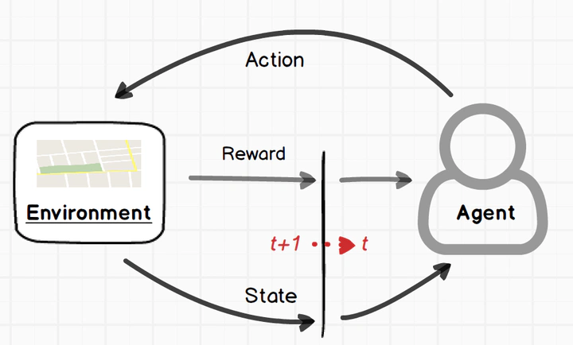
<figcaption>强化学习问题示意图【15】</figcaption>
</figure>

### **强化学习的要素** 

在强化学习中，我们通常将问题描述为一个**[马尔可夫决策过程]{search-entity="1"}**（Markov
Decision Process, MDP），它包含以下几个关键元素：

1\. **状态（State,
S）**：智能体所处的环境状态，可能是游戏画面的一帧，也可能是机器人观测到的传感器数据。

2\. **动作（Action, A）**：智能体在给定状态下可以执行的一系列操作。

3\. **状态转移（Transition Dynamics, P）**：从当前状态 $s$ 采取动作 $a$
后，会以一定的概率转移到下一个状态 $s{\\prime}$。

4\. **奖励（Reward,
R）**：智能体在每个时刻（或每次转移）获得的即时回报，反映了该动作在此状态下的好坏。

5\. **折扣因子（Discount Factor,** $\\gamma$ **）**：用于平衡当前奖励和未来奖励的重要性，数值通常在
(0, 1\] 之间。

6\.
**轨迹（Trajectory）**：在强化学习中，智能体从环境的初始状态开始，与环境交互直至到达终止状态所经历的一系列状态、动作以及相应的奖励就构成了一条完整的"轨迹"。形式上可以表示为：
$\tau = \\{s_0, a_0, r_1, s_1, a_1, r_2, \dots, s_{T-1}, a_{T-1}, r_T, s_T\\}$
。其中， $T$
表示回合（Episode）结束的时间步。在某些不定长的任务中， $T$
可能是一个随机值。轨迹可以帮助我们理解智能体如何从起始状态一步步演化到最终状态，并获取相应的奖励序列。

7\.
**经验（Experience）**：智能体可与环境交互多次，进行多次实验，形成多个轨迹。多个轨迹的集合被称为经验。即
$E = \\{\\tau_1, \\tau_2, \..., \\tau_K \\}$ 。

8\.
**回报（Return）**：强化学习的目标是学习一个好的策略，智能体按照这样的策略和环境交互，让累积奖励达到最大。**这个累积奖励就是回报**。通常指从某一个时间步
t 开始，对未来所有奖励的加总，常用符号 $G_t$ 表示（有时也用 $R$
表示）。其定义为

$G_t = \\sum\_{t=0}\^{T} r\_{t}$

通常现在的奖励和将来的奖励权重是不同的，比如今天奖励1万元和50年后奖励1万元，两者的价值大概率不同。因此会加上折扣因子 $\\gamma$。若存在折扣因子，则回报可以写为：

$G_t = r\_{0} + \\gamma r\_{1} + \\gamma\^2 r\_{2} + \\dots +
\\gamma\^{T} r_T = \\sum\_{t=0}\^{T} \\gamma\^t r_t$

其中 $\\gamma \\in (0, 1]$
用于平衡当前奖励和未来奖励的重要性。如果没有折扣（ $\\gamma = 1$ ），那么回报就是从时间步
$t$
开始直到回合结束所获得的总奖励。在有了回报概念后，我们知道，**强化学习的目标是最大化期望回报**。

9\. **价值函数（Value
Function）****：价值函数衡量的是"期望回报"**。具体分为状态价值函数和动作价值函数。

- - **状态价值函数** $V\^\\pi(s)$
    表示在状态 s 下，后续按照策略 $\\pi$ 行动所能获得的**期望回报**：\
    $V\^\\pi(s) = \\mathbb{E}[\\,G_t \\mid s_t = s\\,]$
  - **动作价值函数** $Q\^\\pi(s, a)$ 表示在状态 s 下执行动作 a，并在之后按照策略 $\\pi$
    行动所能获得的**期望回报**：\
    $Q\^\\pi(s, a) = \\mathbb{E}[\\,G_t \\mid s_t = s, a_t = a\\,]$
  - V用来**评价在某个状态下的策略表现好坏**。Q用来**评价在某个状态-动作对下的策略表现好坏**。价值的估计至关重要，下文还会讨论。

**10：[优势函数]{search-entity="3"}（Advantage
Function）**：优势函数度量的是，在给定状态 s 下，执行某个动作 a
比起在该状态的平均水平（即状态价值）**好多少或差多少**。它的常见形式是

$A^\pi(s, a) = Q^\pi(s, a) - V^\pi(s)$

- 如果 $A\^\\pi(s, a)$ 大于 0，说明在状态 s 下执行动作 a 要比该状态的平均策略价值要好。
- 如果 $A\^\\pi(s, a)$ 小于 0，则说明这个动作比"平均"水平要差。

11\.
探索（**Exploration**）和学习（**Learning**）：强化学习一般分为两个阶段。第一个是**探索阶段**，智能体先按照某些**策略**和环境进行交互，形成经验。第二个是**学习阶段**，智能体按照某些算法，从经验中学习，进而优化自己的**策略**。

12\. **行为策略（Behavior Policy）和目标策略（Target
Policy）：行为策略**是智能体在环境交互时实际执行的策略。**目标策略**是智能体最终想要学到的策略，通常记为
$\\pi$
。两个策略相同就是[on-policy]{search-entity="8"}，否则就是[off-policy]{search-entity="6"}，这点我们在下文中会详细探讨。

------------------------------------------------------------------------

### **价值函数和[贝尔曼方程]{search-entity="7"}** 

在强化学习中，**价值函数（Value
Function）用来衡量在某个状态（或状态-动作对）下，按照某一策略** $\\pi$
**行动所能获得的期望回报**；而**贝尔曼方程（Bellman
Equation）**则刻画了该价值函数所必须满足的"递归一致性"关系。

简而言之，**价值函数**是目标，**贝尔曼方程**是描述这个目标如何在相邻时间步之间相互关联的关键公式。

**1. 二者的关系**

**价值函数的定义**

- - **状态价值函数**：\
    $V\^\\pi(s) = \\mathbb{E}_\\pi[G_t \\mid s_t = s],$
    即"在状态 s 下持续按照策略 $\\pi$ 行动所能获得的期望回报"。\
  - **动作价值函数**：\
    $Q\^\\pi(s,a) = \\mathbb{E}_\\pi[G_t \\mid s_t = s,\\; a_t = a],$
    即"在状态 s 下先执行动作 a，然后继续按照策略 $\\pi$ 行动所能获得的期望回报"。\

**贝尔曼方程的自洽性（递归性）**\
价值函数可以通过对下一步状态（或动作）的价值进行加权求期望而"自我定义"：

- - 对状态价值 $V\^\\pi(s)$
    来说，状态 s 的价值是"执行任一动作后的即时奖励 +
    折扣后下一状态价值"的期望：\
    $V\^\\pi(s) = \\mathbb{E}{a\\sim\\pi(\\cdot|s)}\\Bigl[\\,r(s,a) + \\gamma \\,\\mathbb{E}{s{\\prime}\\sim P(\\cdot|s,a)}[V\^\\pi(s{\\prime})] \\Bigr]$
    \
  - 对动作价值 $Q\^\\pi(s,a)$
    来说，则是"该状态动作得到的即时奖励 +
    折扣后下一状态的动作价值"的期望：\
    $Q\^\\pi(s,a) = \\mathbb{E}{s{\\prime}\\sim P(\\cdot|s,a)}\\Bigl[\\,r(s,a) + \\gamma \\,\\mathbb{E}{a{\\prime}\\sim\\pi(\\cdot|s{\\prime})}[Q\^\\pi(s{\\prime},a{\\prime})] \\Bigr]$

这些方程说明了**：当前状态（或状态-动作）价值**可以通过"下一步的价值"来计算出来，从而使价值函数具备可以迭代求解的性质。

**2. 为什么需要了解贝尔曼方程**

**（1）动态规划与强化学习的理论基础**\
贝尔曼方程是强化学习算法的核心理论根基，揭示了价值函数能够被分解并通过递归方式计算的原理。几乎所有的基于价值的强化学习方法（Q-Learning、SARSA
等）都源于对贝尔曼方程的近似求解或逼近。

**（2）求解或逼近价值函数**

- - 在有完备环境模型、可枚举状态下，可以用**价值迭代（Value
    Iteration）或策略迭代（Policy
    Iteration）**对贝尔曼方程进行数值求解，找到最优价值函数和最优策略。
  - 在无完备模型、无法枚举的复杂环境中，可以采用蒙特卡洛、时序差分（TD
    Learning）以及基于神经网络的近似方法（如
    DQN）对贝尔曼方程进行抽样估计和逼近。

**（3）理解算法更新规则**\
很多强化学习算法中的"更新公式"，本质上都可以视作对贝尔曼方程进行**采样**或**梯度**逼近。例如：\
[Q(s,a) \\;\\leftarrow\\; Q(s,a) \\;+\\; \\alpha \\bigl\[\\,r +
\\gamma\\,\\max\_{a{\\prime}}Q(s{\\prime},a{\\prime}) \\;-\\;
Q(s,a)\\bigr\],]}Q(s{\\prime},a{\\prime}) \\;-\\; Q(s,a)\\bigr],"}\
这正是 Q-Learning 中对**最优贝尔曼方程**的单步采样更新。

**（4）扩展到更复杂场景**

- - 在策略梯度和 Actor-Critic 方法中，Critic
    的目标就是学习满足"贝尔曼方程"的价值函数或 Q 函数。\
  - 其它如分层强化学习、多智能体强化学习等场景中，依旧离不开对贝尔曼方程的变形或推广。

\

**总之，**

- **价值函数**为评估"当前状态（或动作）有多好"提供了一个"期望回报"的度量。
- **贝尔曼方程**阐明了价值函数可以被分解成与下一状态和相应奖励相联系的自洽递归关系。

------------------------------------------------------------------------

### A、V、Q的关系 

优势函数（A）与值函数（V）、动作值函数（Q）的区别的**联系**：

优势函数是Q和V的差值。

$A\^{\\pi}(s, a) = Q\^{\\pi}(s, a) - V\^{\\pi}(s)$(s, a) = Q^{\\pi}(s, a) - V^{\\pi}(s)"}

\

优势函数与值函数、动作值函数的**区别**：

- **值函数（V）**：衡量一个状态的价值，反映了在某个状态下，智能体根据当前策略所能期望得到的总回报。
- **动作值函数（Q）**：直接衡量在某状态下采取某动作后，智能体所能期望得到的总回报。
- **优势函数（A）**：是一个动作对比的度量，表明选择某个动作相较于平均策略的回报增益。和V、Q不同的是，A提供了一个相对的评价。

### 估计值函数的三种方法：MC、TD、GAE 

RL中，价值的估计非常重要。估计值函数的常见方法有三种：蒙特卡洛（MC）、时间差分（TD）、[广义优势估计]{search-entity="9"}（GAE）。

它们在估计值函数时各有优缺点，具体在方差和偏差之间存在不同的权衡。

**1. [蒙特卡洛方法]{search-entity="5"}（MC）**

•
**原理**：蒙特卡洛方法通过在完整的轨迹上计算回报（即从当前状态开始到最终状态的累积奖励）来估计状态值函数或动作值函数。这个方法完全依赖于最终的回报，因此需要等待完整的路径（完整的Episode）来计算值。

• **优点**：

- 不需要任何模型假设，直接依赖实际回报。
- 在长期内是无偏的（即期望值是正确的），因为它直接使用实际的累积奖励。

• **缺点**：

- 高方差：由于只使用每个Episode的最终回报，导致每个回报的估计可能存在较大波动，尤其是在奖励信号稀疏或变动较大的情况下，估计的方差较大。

**总结**：MC方法因为依赖完整的回报，所以它的估计有较大的方差，但没有偏差。

**2. [时序差分方法]{search-entity="2"}（TD）**

•
**原理**：时序差分方法则是通过**递推更新**（也称为bootstrapping）来估计值函数，它并不需要等待完整的Episode，而是根据每一步的即时反馈进行更新。TD方法将当前的估计值与下一时刻的估计值进行比较，通过差分来更新当前状态的值。

• **优点**：

- 较低的方差：由于TD方法使用每一步的即时反馈，它不依赖于完整Episode的回报，估计过程可以在更短时间内进行，因而方差较小。
- 可以在线学习，不需要等待完整的Episode。

• **缺点**：

- 高偏差：由于TD方法使用的是估计值而非真实回报，它会引入一定的偏差。特别是它依赖当前的估计来更新，因此如果初始估计有偏，后续的更新也会继承这个偏差。

•
**总结**：TD方法具有较低的方差，但它引入了偏差，因为它依赖于现有的估计，而非实际的回报。

**3. 广义优势估计（GAE）**

•
**原理**：GAE是一种折中方法，它结合了MC和TD的方法，旨在通过平衡方差和偏差来提高估计的稳定性和效率。GAE通过引入一个**超参数**
$\\lambda$
（类似于TD方法中的折扣因子），在计算优势函数时利用TD方法的部分信息，而不是完全依赖于真实的回报。

•
具体来说，GAE通过对TD误差进行加权平均来估计优势函数，从而减少单步TD误差带来的偏差，并控制方差的大小。

• 它的更新公式为：

$A_t\^{\\lambda} = \\sum\_{l=0}\^{\\infty} (\\gamma \\lambda)\^l
\\delta\_{t+l}$ = \\sum_{l=0}^{\\infty} (\\gamma \\lambda)^l \\delta_{t+l}

\

其中， $\\delta\_{t+l}$"}
表示每一步的TD误差， $\\gamma$
是折扣因子， $\\lambda$
是用于加权的超参数，控制了TD和MC的折中。

- **优点**：
  - 在方差和偏差之间取得了更好的折中。通过调节 $\\lambda$ ，GAE可以灵活控制偏差和方差之间的权衡。
- **缺点**：
  - 相较于纯粹的TD或MC，GAE需要更多的计算，因为它需要在每一步计算加权的TD误差。
- **总结**：GAE通过加权TD误差，能够在MC的低偏差和TD的低方差之间取得一个折中。

\

**4. 高方差、低偏差 vs. 高偏差、低方差的折中**

- **MC方法**高方差是由于它依赖于整个轨迹的回报，导致估计可能存在较大波动，但它是无偏的，因此在长时间运行时可以获得精确的估计。
- **TD方法**则通过引入当前估计来更新状态值或动作值，它减少了方差，因为每次更新都基于当前估计的反馈。然而，它依赖于已有的估计，因此会引入偏差。
- **GAE**则通过平衡这两者的优缺点，调整 $\\lambda$
  来控制估计中的偏差和方差，从而获得更稳定、更准确的估计。当 $\\lambda =
  0$ 时，GAE等价于TD(0)，当
  $\\lambda = 1$
  时，GAE等价于MC方法。

**总结**

- **MC方法**：高方差，无偏。
- **TD方法**：低方差，高偏差。
- **GAE方法**：折中，既能减少偏差，也能降低方差，通过调整
  $\\lambda$ 来灵活控制。

这个折中使得GAE在实际应用中往往能取得更好的性能，特别是在复杂的强化学习任务中。

\

### NLP中的RL 

<figure data-size="normal">
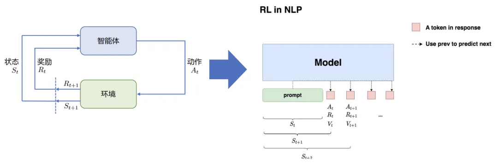
<figcaption>RL in NLP【5】</figcaption>
</figure>

**状态S**：输入prompt

**动作A**：输出response（即LLM输出下一个token）

**奖励R**：根据prompt+response进行奖励模型打分

**整体目标**：给定prompt，调整policy，生成符合人类喜好（RM偏序信号）的response

### 经典强化学习算法的分类 

\

<figure data-size="normal">
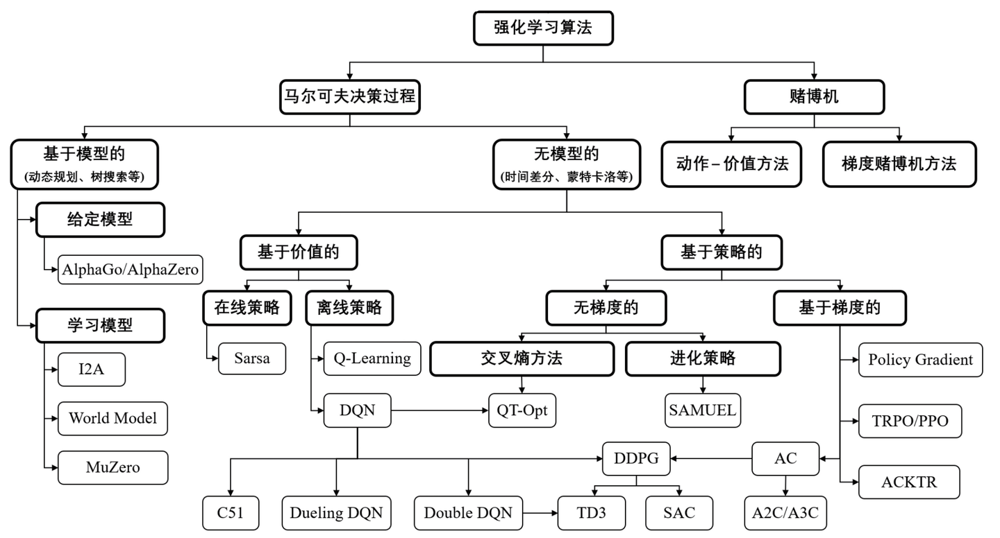
<figcaption>强化学习算法分类【14】</figcaption>
</figure>

在这里，对里面的部分算法做简要介绍。

------------------------------------------------------------------------

**马尔可夫决策过程（MDP）**

**马尔可夫性质**表示未来状态只与当前状态（和动作）有关，与过去的历史无关。这使得我们可以用一个状态来完整地描述环境。

\

**马尔可夫决策过程（MDP）**是一个在"马尔可夫性质"假设下建模序列决策的问题框架，一般用五元组
$\\langle S, A, P, R, \\gamma \\rangle$ 表示，其中：

• $S$ ：状态空间

• $A$ ：动作空间

• $P(s{\\prime} \\mid s,a)$ \\mid s,a)"} ：状态转移概率，描述在状态
$s$ 执行动作 $a$ 后转移到下一个状态 $s{\\prime}$"} 的概率

• $R(s,a)$
：即时奖励函数，衡量在状态 $s$ 执行动作
$a$ 所得到的回报

• $\\gamma$
：折扣因子，用于平衡当前奖励和未来奖励

在MDP中，智能体通过与环境的反复交互（"状态---动作---转移---奖励"的循环），旨在找到一条最优策略
$\\pi\^\*$
，最大化长期累积折扣回报。

------------------------------------------------------------------------

**Bandit problem（强盗问题或赌博机问题）**

**Bandit problem**
是强化学习和决策理论中的经典问题，用于研究**在不确定环境下的探索与利用权衡（exploration
vs. exploitation trade-off）**。

赌博机（Bandit）问题可视作MDP的极简形式**：系统仅有一个"状态"，或者说对后续状态没有区分**。每台赌博机（或称拉杆）对应一个动作，每个动作产生的奖励分布未知且相互独立。智能体在每次操作前需在各臂之间进行抉择，在缺乏状态转移的情况下，通过不断探索各臂的回报分布并利用已有信息，从而最大化累积奖励。**相比MDP，Bandit只关注"当前选择---即时奖励"的单步决策，不涉及序列性的状态演化**。

\

**Bandit Problem 的类型**

1\. **多臂老虎机（Multi-Armed Bandit, MAB）**

- 基础形式，假设每台老虎机的奖励分布是固定的（静态）。
- 常见算法包括：
  - **ε-greedy**：以一定概率随机探索，其他时候利用当前最优选项。
  - **UCB（上置信界）**：根据当前奖励估计和不确定性选择最优选项。
  - **Thompson Sampling**：通过贝叶斯推断选择最优选项。

2\. **Contextual Bandit（上下文老虎机）**

- 每次决策前会观察到一个"上下文"（context），不同上下文可能对应不同的最优选项。
- 类似于推荐系统问题：根据用户特征选择推荐内容。

3\. **Non-Stationary Bandit（非静态老虎机）**

• 奖励分布会随着时间动态变化，需要更快速适应新分布的算法。

------------------------------------------------------------------------

**DQN（Deep Q-Network）**

**DQN**将深度神经网络与Q-Learning相结合，使用卷积神经网络近似Q函数，在Atari游戏上取得革命性成果。

关键技巧：

1\. **Experience
Replay**：将交互经验存储在回放池中，随机小批量采样来打破数据相关性；

2\. **Target Network**：固定目标Q网络一段时间再更新，避免网络剧烈震荡。

------------------------------------------------------------------------

**[Actor-Critic架构]{search-entity="0"}**

为平衡高方差和低偏差，在**Actor-Critic**中将策略函数（Actor）和价值函数（Critic）同时学习：

• **Actor**：输出策略 $\\pi\_\\theta(a\|s)$ ；

• **Critic**：估计价值函数 $V_w(s)$ 或 $Q_w(s,a)$ ；

• 每一次采样时，利用 Critic 来估计动作优势（Advantage），更新 Actor
的梯度，使得训练更稳定。

\

### RL的两大基本特征 

强化学习（Reinforcement Learning,
RL）拥有两大关键特征：一是通过持续的**试错搜索（trial-and-error）来发现最佳行为，二是面临延迟回报（delayed
reward）**的挑战。这使得强化学习与监督学习在"如何评价模型"这一核心问题上存在显著差异：

•
在监督学习中，模型会根据事先给定的正确标签（label）得到即时且明确的反馈；

•
而在强化学习中，智能体的评价取决于整个互动过程中所作出的一系列动作，只有通过对**累计获得的奖励**进行评估，才能衡量策略的优劣。

换言之，监督学习用"已知正确答案"来指导模型学习，而强化学习则是让智能体在环境中不断尝试、观察反馈，再基于累积奖励对策略进行调整，从而逐步逼近最优方案。

### 探索与利用的平衡 

在强化学习（RL）中，**探索（Exploration）与利用（Exploitation）**的平衡是核心挑战：探索指尝试新动作以获取环境信息，利用则基于当前知识选择最优动作以最大化奖励。**过度探索可能导致低效，过度利用则易陷入局部最优**。常见方法包括：

1.  **ε-greedy**：以概率ε随机探索，其余时间贪婪利用；
2.  **Upper Confidence
    Bound（UCB）**：通过置信区间量化动作不确定性，平衡二者；
3.  **Thompson Sampling**：基于贝叶斯后验分布动态调整动作选择；
4.  **基于内在激励**（如好奇心驱动）或**信息增益**，鼓励访问未充分探索的状态；
5.  **Softmax策略**：按动作价值概率分布采样，兼顾高价值与潜在高回报动作。部分算法（如MCTS）结合基于模型的规划进一步优化此平衡。

### RL中的on-policy 和 off-policy有什么区别？ 

在强化学习中，**on-policy** 和 **off-policy**
的区别，核心在于"**数据采样的策略（Policy）与学习的策略是否相同**"。以下从原理、示例、优缺点几个方面说明：

**1. 原理概念**

1\. **on-policy**

• **数据采样策略 与 当前正在学习/更新的策略 相同**。

• 智能体执行的行为策略（Behavior
Policy）就是要学习或评估的目标策略（Target Policy）。

• 换言之：智能体在环境中如何行动，就和我们要学的那条策略完全一致。

2\. **off-policy**

• **数据采样策略 与 学习/评估的目标策略 不必相同**。

• 可以用一种行为策略与环境交互，收集到的数据却用来学习另一种目标策略。

• 常见做法是保留一个**经验回放池（Replay
Buffer）**，历史数据可以不断被重用（不一定是按照当前策略采样得到的）。

------------------------------------------------------------------------

**2. 示例对比**

1\. **on-policy**

- **PPO**、**A2C/A3C** 等。
- 在 PPO
  中，为了保证策略稳定性，需要用最新的（或近似最新的）策略去采样交互数据，然后紧接着对这批数据进行更新，更新后又要丢弃旧数据，重新采样。
- 好处是可以严格保证"策略分布"和"数据分布"一致，**收敛性**更易分析。
- 坏处是**数据利用率低**，因为一旦策略更新，这批数据就算"过期"了，很难重复使用来训练新策略。

2\. **off-policy**

- **Q-Learning**、**DQN**、**SAC**、**TD3** 等。
- DQN 中的经验回放池就是典型的 off-policy：采集数据时使用的是
  $\\epsilon-greedy$
  策略（带随机探索），但在更新 Q 函数时，我们朝着 "greedy"
  或某个更优的目标策略方向改进。
- 好处是可以**重复使用**历史数据，样本效率更高；还可以从人类示教数据或其他智能体的轨迹中学习。
- 坏处是策略与数据分布不一致带来的复杂性，可能更难保证收敛，更新过程也更易出现分布偏移（Distribution
  Shift）问题。

------------------------------------------------------------------------

**3. 优缺点总结**

  -------------- -------------------------------- ----------------------------------------------
  关键点         on-policy                        off-policy
  数据采样策略   与目标策略相同                   与目标策略不同，可自行选择或混用
  数据利用率     只能使用最近采样数据，效率较低   可以反复使用历史数据，效率较高
  学习稳定性     分布一致性更好，算法分析更直接   数据分布差异大时，学习可能会不稳定
  示例算法       A2C/A3C、PPO 等                  Q-Learning、DQN、SAC、TD3 等
  适用场景       中小型或交互稳定场景             大规模、需要高数据效率或可以使用离线数据场景
  -------------- -------------------------------- ----------------------------------------------

------------------------------------------------------------------------

**4. 为什么要区分 on-policy 和 off-policy**

• **策略分布一致性**：

强化学习的目标是学习一条最优策略（或评估某条策略的价值）。若数据来自与目标策略不同的分布，我们就需要更多技巧（如重要性采样、行为策略修正）来保证学习的正确性。

• **数据效率**：

on-policy 经常"采样-训练-丢弃"，数据无法重复利用；off-policy
通过经验回放或从其他来源引入大量轨迹数据，能反复训练，提高数据效率。

• **安全性与可控性**：

某些场景需要在策略稳定前就保证系统安全，off-policy
可以用保守的行为策略来收集数据，而学的却是更激进的目标策略。

------------------------------------------------------------------------

**总结**

- **on-policy**：数据采样与目标策略一致，保证分布统一，算法理论分析更简洁，但数据浪费较大。
- **off-policy**：数据来源灵活，可以重复使用过去的经验，样本效率更高，但需要处理分布偏移带来的额外复杂性。

这就是两者在强化学习中的本质区别。**off-policy
RL可以理解为"纸上得来终觉浅"，on-policy RL可以理解为"绝知此事要躬行"。**

\

### RL中的online和offline有什么区别？ 

在线强化学习(Online Reinforcement Learning)和离线强化学习(Offline
Reinforcement
Learning)是强化学习领域的两种不同学习范式，**它们的主要区别在于如何使用经验数据（即智能体与环境交互产生的状态、动作、奖励序列）来训练模型。**下面是两者之间的几个关键差异：

**数据收集方式**：

- **在线强化学习**：在学习过程中，智能体直接与环境实时交互，每一步选择动作、接收环境反馈（奖励和下一个状态），并立即用这些新鲜数据更新其策略或价值函数。这意味着学习策略会直接影响到实际行为，并且环境需要是可交互的。
- **离线强化学习**：事先从一个固定的数据集（通常是之前交互产生的）中学习，不与环境实时互动。这个数据集可以是通过专家演示、历史记录或其他代理的行为收集的。离线学习的目标是从这些静态数据中最大化学习效率，而无需进一步探索环境。

**探索与利用的平衡**：

- **在线学习**强调在探索未知策略与利用当前最优策略之间找到平衡，因为每次决策都直接影响到学习过程和未来奖励。
- **离线学习**则主要关注于利用已有的数据，由于没有新的数据采集，探索新策略的能力受限，因此重点在于如何有效利用现有数据优化策略。

**安全性和稳定性**：

- **离线强化学习**因为不直接与环境互动，所以特别适合于那些直接尝试可能有高风险或成本的场景，比如医疗决策、金融交易或物理机器人控制。
- **在线学习**可能涉及试错，对于某些敏感或昂贵的环境来说，错误的决策可能会导致不可逆的后果。

**数据效率与收敛速度**：

- **离线学习**可能在数据利用上更为高效，因为它试图从有限的数据集中榨取尽可能多的信息。但找到最佳策略的速度可能受限于数据集的覆盖范围和多样性。
- **在线学习**理论上可以无限探索，直至找到最优策略，但这个过程可能需要大量与环境的交互，从而在数据需求和时间成本上更高。

**策略优化自由度**：

- **在线学习**允许智能体根据即时反馈调整策略，因此在策略空间中的探索更加灵活。
- **离线学习**受限于已收集数据的策略空间，难以评估未被数据覆盖的动作的好坏，因此优化策略时可能较为保守。

综上所述，选择在线还是离线强化学习取决于具体的应用场景、可用资源、对安全性的要求以及对学习速度和数据效率的需求。

### **on/off-policy和online/offline的区别** 

1\. **不同维度**

- **on/off-policy** 解决的问题**："采样策略"与"目标策略"的一致程度**。
- **online/offline** 解决的问题**："是否可以持续交互收集新数据"**。

2\. **常见组合**

**离线强化学习基本一定是 off-policy，但在线强化学习可以既有
on-policy，也可以有 off-policy。**

- **在线 + on-policy**：比如 PPO、A2C
  这些算法，需要跟环境交互，采集数据时就使用当前策略，采完就更新，旧数据不再使用。
- **在线 + off-policy**：比如 DQN，虽然也是在线与环境交互，但 DQN
  会把交互数据放到 replay
  buffer，后面训练时用到的旧数据不一定来自当前的策略，所以是
  off-policy。
- **离线 + off-policy**：这最常见。离线 RL
  必然不能和"当前目标策略"一致地采样，因为数据集已经固定了，通常是其他策略或历史操作生成的数据，所以几乎都是
  off-policy。
- **离线 +
  on-policy**：理论上很难，因为离线数据本身就是固定收集的，跟当前想学的策略无法保持一致------所以离线强化学习通常都被视为
  off-policy 的特例。

\

### 重要性采样基本原理 

重要性采样是一种统计方法，**用来在目标分布** $p(x)$ **与采样分布** $q(x)$ **不一致的情况下，调整采样结果的权重，使得从**
$q(x)$ **中采样的数据可以用于估计**
$p(x)$ **的期望。【10】**

假设我们希望计算目标分布$p(x)$
下某个函数 $f(x)$ 的期望：

[\\mathbb{E}\_p\$f(x)\$

如果$p(x)$很难直接采样，但可以从一个容易采样的分布 $q(x)$ 中采样，则可以通过以下公式重写：

[\\mathbb{E}\_p\[f(x)\] = \\int f(x) \\frac{p(x)}{q(x)} q(x) \\,
dx]_p[f(x)] = \\int f(x) \\frac{p(x)}{q(x)} q(x) \\, dx"}

其中， $\\frac{p(x)}{q(x)}${q(x)} 称为**重要性权重（Importance Weight）**。

\

**重要性采样的作用是什么？**为什么需要它？

重要性采样允许我们使用与目标分布不同的采样分布，从而：

- 提高采样效率，尤其在$p(x)$较难采样的情况下；
- **在强化学习中，它允许我们基于旧策略生成的经验数据来优化新策略，而无需重新采样环境数据。**

\

### **Bradley-Terry Model** 

**The Bradley-Terry Model** 是一种统计模型，用于处理成对比较（pairwise
comparisons）的问题，目的是估计多个对象之间相对偏好的概率。例如，给定两项选择
A 和 B ，该模型估计 A 相对于 B 被偏好的概率。

**Bradley-Terry Model 的基本形式**

对于两个对象 $i$ 和 $j$ ，模型定义对象 $i$
被偏好的概率为：

$P(i \\succ j) = \\frac{\\exp(\\beta_i)}{\\exp(\\beta_i) +
\\exp(\\beta_j)}${\\exp(\\beta_i) + \\exp(\\beta_j)}

其中：

• $\\beta_i$ 和
$\\beta_j$ 分别是对象
$i$ 和 $j$
的潜在得分（latent score）。

•
该模型的核心假设是：偏好的概率仅由对象的潜在得分决定，且满足**逻辑斯谛分布**。

\

**Bradley-Terry Model 的用途**

• 该模型被广泛用于排序和评分系统，如体育比赛、推荐系统、搜索结果排序等。

•
在强化学习中，它可以用于**建模奖励函数**，特别是在基于偏好反馈的场景下。

\

### REINFORCE 和 PPO的区别和联系 

在强化学习中，REINFORCE 和 PPO
同属于**基于策略梯度**的方法，但在**更新方式**和**稳定性**上有本质差异。

**REINFORCE**

- **特点**
  - **最简单的策略梯度算法，也称"蒙特卡洛策略梯度"**，在每个回合结束后，直接基于整条轨迹的回报来更新策略。
  - 更新时使用 $\\log \\pi\_\\theta(a_t \\mid s_t)$
    乘以当时获得的总回报，获取策略梯度。
- **优点**
  - 理论推导相对直接，概念简单，常用于基础教学和小规模实验。
  - 对问题没有过多结构假设，容易与其他方法结合（如引入基线减小方差）。
- **缺点**
  - **高方差**：需要大量样本才能得到稳定的梯度估计。
  - **效率较低**：一次采样后便更新，不能多次利用同一批数据。

\

**PPO**

- **特点**
  - 属于 Trust Region Policy Optimization
    的简化版，通过限制新旧策略的更新幅度来保证训练稳定性。
  - 训练时，可在同一批数据上做多次迭代更新，但会对新旧策略的概率比率施加"剪切"或"KL
    惩罚"，防止一步迈得过大。
- **优点**
  - **训练更稳定**：限制策略更新，使得学习过程不易崩溃。
  - **样本利用率更高**：对同一批次数据多次梯度更新，提高效率。
- **缺点**
  - 实现与调参相对更复杂，需要合适的超参数（如剪切阈值、KL 系数等）。
  - 仍是 on-policy 方法，对离线数据的利用相对有限。

\

**REINFORCE 和 PPO的核心区别**

- **更新方式**
  - REINFORCE：整条轨迹结束后一次性更新，仅用该次采样的数据。
  - PPO：可以多次使用同一批数据，用截断或 KL 惩罚约束更新。
- **稳定性与效率**
  - REINFORCE：简单但高方差、低效率。
  - PPO：限制策略变化幅度，显著提升稳定性与收敛速度。

因此，**REINFORCE** 常被视为最基础的策略梯度方法，适合讲解原理；而
**PPO** 则在实践中更常见，因其能在保持收敛性和稳定性的同时充分利用数据。

### 强化学习（RL）相比有监督微调（SFT）有哪些好处？ 

我们知道RL对于提升LLM的性能有很重要的作用，那么具体作用是什么呢？你真的知道为什么要用RL吗？RL的必要性在哪里？

**第一点，RL相比SFT更有可能考虑整体影响。**SFT是针对单个token进行反馈，其目标是要求模型针对给定的输入给出确切的答案；而RL是针对整个输出文本进行反馈，并不针对单个token。这种反馈粒度的不同，使得RL既可以兼顾表达的多样性，又可以增强对微小变化的敏感性。由于自然语言的灵活性，相同的语义可以用不同的方式表达，SFT很难兼顾，而RL可以允许模型给出不同的多样性表达。此外SFT采用交叉熵损失，由于总和规则，总的Loss对个别词元的变化不敏感，也就是说改变个别词元对整体损失影响较小，但是在语言中，一个否定词就可以完全改变文本的整体含义。**RL可以通过奖励函数同时兼顾多样性和微小变化敏感性两个方面。**

**第二点，RL更容易解决幻觉问题**。在模型不知道答案的情况下，SFT会促使模型给出答案。而使用RL则可以通过定制奖励函数，使得正确答案有很高的分数，放弃回答或回答不知道有中低分数，不正确的回答有非常高的负分，这样模型可以依赖内部知道选择放弃回答，从而缓解幻觉问题。

**第三点，RL可以更好地解决多轮对话奖励累计的问题**。多轮对话的好坏，要考虑多次交互的整体情况，很难用SFT的方法构建，而使用RL，可以通过构建奖励函数，根据整个对话的背景及连贯性对当前模型输出的优劣进行判断。

此外，还可以参考这篇文章：

[[https://www.]{.invisible}[zhihu.com/question/6510]{.visible}[21172/answer/3513159005?utm_psn=1778953635276931072]{.invisible}[]{.ellipsis}](https://www.zhihu.com/question/651021172/answer/3513159005?utm_psn=1778953635276931072){.internal
target="_blank"}

\

### 大模型的3H原则是什么？ 

大模型的3H原则是：

- 帮助性（Helpfulness）
- 真实性（Honesty）
- 无害性（Harmless）

### 对齐税（Alignment Tax） 

RLHF 微调通常伴随着多样性和语言流畅性的下降，这种现象被称为 **alignment
tax【21，22】**。

**分布外泛化能力（**out-of-distribution (OOD)
generalisation**）**在模型面临广泛的现实场景时至关重要，而**输出多样性（**output
diversity**）**则指模型生成多样化输出的能力。论文【22】研究发现，**与SFT相比，RLHF在处理新输入时的泛化能力更强，尤其是在训练数据与测试数据之间分布偏移较大的情况下**。然而，**与SFT相比，RLHF在多种衡量标准下显著降低了输出多样性**，这表明当前LLM微调方法在泛化能力和多样性之间存在权衡。

\

### Reward Hacking 

在RL中，由于reward
function设置不合理，导致agent只关心累计奖励，而并没有朝着预想的目标优化【24】。

"上有政策，下有对策"，下面这个故事可以很形象地展示Reward Hacking的问题：

> 在印度殖民时期，政府为了减少眼镜蛇数量，悬赏每捕捉一条眼镜蛇给予奖励。一开始，人们积极捕蛇换钱，但后来一些人发现可以养蛇并假装捕捉，以赚取更多奖励。\
> 政府发现后取消了奖励政策，结果养蛇的人将蛇全部放生，导致蛇的数量比最初更多。\
> **寓意**：这是奖励机制设计失误（Reward
> Hacking）的典型案例，说明如果奖励不精准，会导致行为偏离初衷，甚至适得其反。

在RLHF中，奖励模型每次偏好的数据应该是针对我们优化目标更好的回答，但如果这些更好的回答都是更长的回答，那么模型在学习时会取巧，偏向于更长的回答。而在真正使用时，更长的回答未必更好。

\

## RLHF（RM+PPO） 

### RLHF的整体流程是什么？ 

RLHF主要分为**奖励模型训练**和**近端策略优化（Proximal Policy
Optimization, PPO）**两个步骤。

- 奖励模型通过由人类反馈标注的**偏好数据**来学习人类的偏好，判断模型回复的有用性以及保证内容的无害性。奖励模型模拟了人类的偏好信息，能够不断地为模型的训练提供奖励信号。
- 在获得奖励模型后，需要借助强化学习对语言模型继续进行微调。近端策略优化可以根据奖励模型获得的反馈
  优化模型，通过不断的迭代，让模型探索和发现更符合人类偏好的回复策略。

<figure data-size="normal">
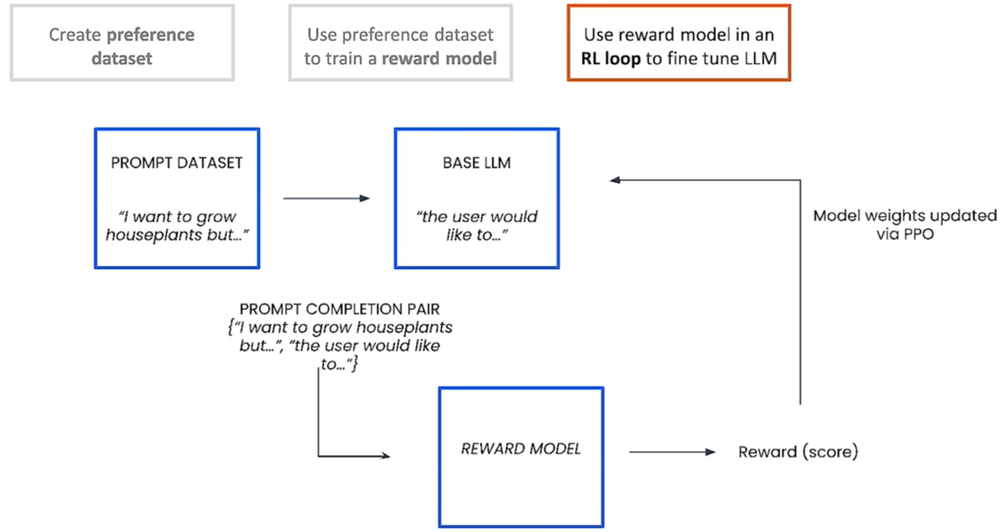
<figcaption>RLHF整体流程【3】</figcaption>
</figure>

\

### RLHF中有哪些数据集？ 

RLHF中有三种数据集，分别是：

- 偏好数据集：用来训练奖励模型。
- 提示数据集：在PPO流程中用来训练LLM。
- 评估数据集：用来评估RLHF的效果。

### PPO中的4个模型及其作用 

PPO涉及到actor/critic/reward/reference
4个模型的协同训练和推理，这四个模型的详细解释如下：

1.  **策略模型（Policy Model，或Actor
    Model）**，生成模型回复。它就是RLHF训练希望产出的模型。在PPO训练中更新梯度。
2.  **奖励模型（Reward
    Model）**，输出奖励分数来评估回复质量的好坏。在PPO训练中不更新梯度。
3.  **评论模型（Critic Model，或Value
    Network）**，来预测回复的好坏，可以在训练过程中实时调整模型，选择对未来累积收益最大的行为。在PPO训练中更新梯度。
4.  **参考模型（Reference Model）**提供了一个 SFT
    模型的备份，帮助模型不会出现过于极端的变化。在PPO训练中不更新梯度。

### PPO的Policy模型的目标函数 

<figure data-size="normal">
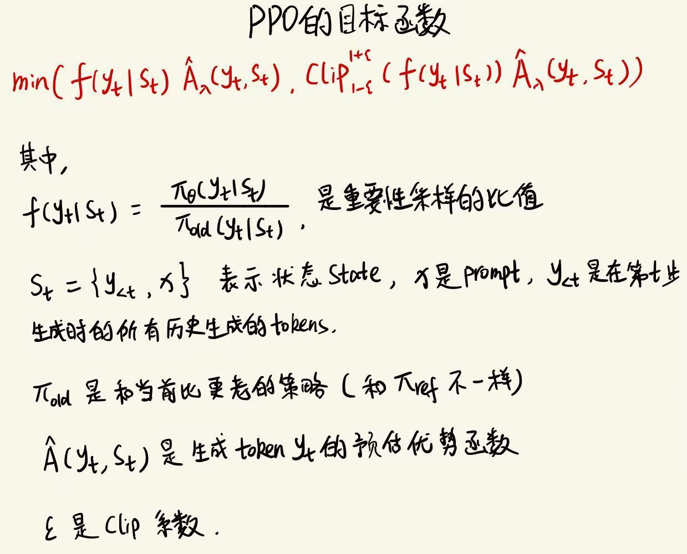
<figcaption>PPO的目标函数</figcaption>
</figure>

\

### 为什么需要训练奖励模型（RM）？ 

在RL的流程中，利用人类标注的反馈数据也可以对模型进行微调，但是，由于时间和成本的限制，针对每次优化迭代，人类很难提供足够的反馈。所以训练一个奖励模型是一个更为有效的方法，利用奖励模型模拟人类的评估过程。

RM决定了智能体如何从与环境的交互中学习并优化策略，以实现预定的目标，因此训练一个RM模型非常重要。

### 奖励模型（RM）是怎么训练的？ 

**奖励模型（RM）的训练流程如下**：

1\.
**收集偏好数据**：用初始模型生成多个回答，让人类标注者进行两两比较或打分，从而获得「更优回答」的偏好数据。

2\. **对偶对比训练**：令奖励模型输出一个标量评分
$R(\\text{回答})$)"}
；对同一问题的回答A和回答B，若人类偏好A，则训练目标是 $R(A) \>
R(B)$ ，常用对数似然形式的
$\\sigma(R(A) - R(B))$
来表示。

3\. **模型结构**：通常在预训练语言模型的基础上添加一个"Reward
Head"，对文本输出打分。

4\.
**使用场景**：在PPO等强化学习阶段，用奖励模型为生成的回答打分，并将其作为奖励信号来优化策略模型，使生成结果更符合人类偏好。

### RM的损失函数 

<figure data-size="normal">
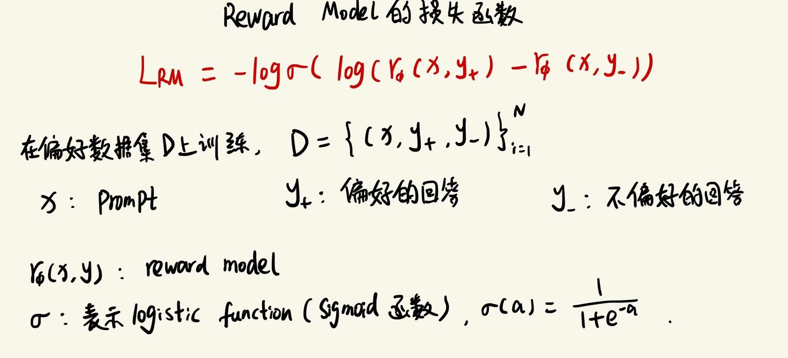
<figcaption>奖励模型RM的损失函数</figcaption>
</figure>

### PPO的流程是什么 

PPO的实施流程如下：

1.  环境采样**：策略模型**基于给定输入生成一系列的回复，**奖励模型**则对这些回复进行打分获得奖励。
2.  优势估计：利用**评论模型**预测生成回复的未来累积奖励，并借助广义优势估计（Generalized
    Advantage
    Estimation，GAE）算法来估计优势函数，能够有助于更准确地评估每次行动的好处。
3.  优化调整：使用优势函数来优化和调整**策略模型**，同时利用**参考模型**确保更新的策略不会有
    太大的变化，从而维持模型的稳定性。

<figure data-size="normal">
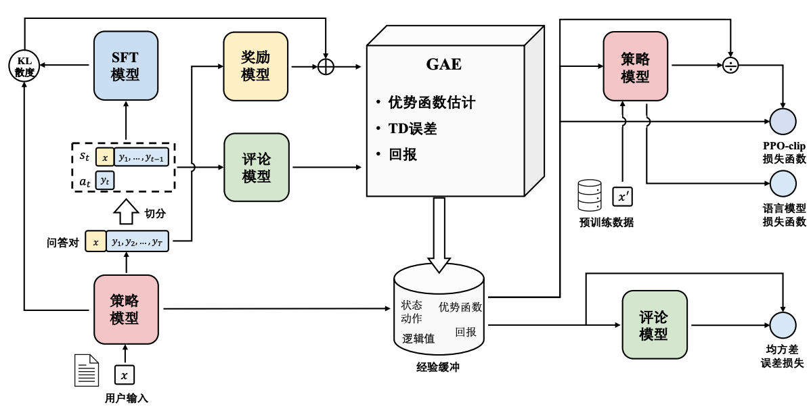
<figcaption>RLHF中PPO的流程【4】</figcaption>
</figure>

------------------------------------------------------------------------

作为PPO流程的补充，参考下面这张图，可以划分为**经验采样**和**训练**两个阶段【5】。

**第一阶段经验采样**，也叫做rollout，就是滑跑的意思，在RL中可以理解为一次实验，也就是actor模型在当前环境下进行策略动作的过程，具体实现上就是actor模型根据prompt数据集进行generate生成response，然后根据prompt+response进行forward计算，得到logp/values/reward等元素，这里**涉及到actor、reference、critic、reward
4个模型的推理过程**；

**第二阶段就是训练流程**，涉及到**actor和critic两个模型**，从计算loss来看，算法上是相互独立的，本质上是两个模型独立训练。

<figure data-size="normal">
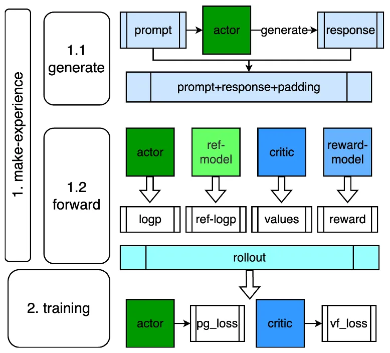
<figcaption>PPO训练流程【5】</figcaption>
</figure>

\

### critic model和reward model有什么区别 

在 RLHF 中，**Reward Model**
通过人类标注数据进行独立训练，旨在输出一个反映人类偏好的外部奖励分数，用于评估完整回复的质量；而
**Critic Model**
则与策略模型同步更新，侧重在训练过程中动态估算生成过程的价值或优势，帮助策略模型迭代优化。前者提供整体的外部评估信号，后者主要在内部学习如何预测长期回报。

### PPO中优势函数指什么 

在PPO算法中，**优势函数（Advantage
Function）用于评估状态-动作对的相对优劣程度。它衡量了执行某个动作相对于平均水平的优劣，即在给定状态下采取某个动作相对于采取平均动作的效果。**

优势函数可以用以下方式定义： $Advantage(s, a) = Q(s, a) -
V(s)$

其中， $Advantage(s, a)$
表示在状态 $s$ 下采取动作 $a$ 的优势函数值， $Q(s, a)$ 表示状态动作对 $(s, a)$ 的动作值函数（也称为动作优势函数）， $V(s)$ 表示状态值函数。

优势函数的作用在于帮助评估当前动作的相对价值，以便在策略更新过程中确定应采取的动作。**通过比较不同动作的优势函数值，可以决定哪些动作是更好的选择**。正的优势函数值表示执行的动作比平均水平更好，而负的优势函数值表示执行的动作比平均水平更差。

在PPO算法中，**优势函数用于计算策略更新的目标，以便调整策略概率分布来提高优势函数为正的动作的概率，并降低优势函数为负的动作的概率，从而改进策略的性能**。

总而言之，优势函数在PPO算法中用于评估状态-动作对的相对优劣，帮助确定应该采取的动作，并在策略更新过程中引导策略向更优的方向调整。

### GAE是什么？ 

**GAE（Generalized Advantage
Estimation）**在RLHF中是一种用来估计优势函数（Advantage
Function）的方法，**目的是在策略梯度更新时减少方差并保持较小的偏差**。它通过在时间差分（TD）误差之上叠加一个带衰减因子（
$\\lambda$
）的加权和，得到平滑且稳定的优势估计，从而帮助强化学习算法（如PPO）更有效地利用来自人类反馈的奖励信号进行训练。
$\\lambda$ **越接近
1，**代表将更多的未来奖励纳入考虑，优势估计会更加依赖长时间序列的回报，**偏差更小**但**方差更高**。
$\\lambda$ **越接近
0，**代表更依赖单步TD误差，优势估计主要由局部信息决定，**偏差更大**但**方差更小**。

### 重要性采样和clip 

在PPO算法中，重要性采样（Importance
Sampling）**和**剪辑（Clipping）机制是确保策略更新稳定性和效率的关键。

**1. 重要性采样（Importance Sampling）**

在强化学习中，策略的更新需要利用从环境中采集的数据。然而，直接使用新策略进行采样可能效率低下。为此，PPO采用重要性采样技术，利用旧策略下采集的数据来估计新策略的期望。

具体而言，重要性采样比率定义为：$\\frac{\\pi\_\\theta(y_t \\mid
s_t)}{\\pi\_{\\text{old}}(y_t \\mid s_t)}${\\pi_{\\text{old}}(y_t \\mid s_t)}
。其中， $\\pi\_\\theta(y_t \\mid s_t)$ 和 $\\pi\_{\\text{old}}(y_t \\mid
s_t)$}(y_t \\mid s_t)"}
分别表示新旧策略， $y_t$ 和
$s_t$
分别表示动作和状态。通过该比率，PPO能够调整旧策略下的采样数据，使其适用于新策略的更新，从而提高数据利用率。

**2. 剪辑机制（Clipping）**

尽管重要性采样提高了数据利用效率，但如果新旧策略差异过大，可能导致训练过程不稳定。为此，PPO引入剪辑机制，限制重要性采样比率的变化范围，防止策略更新过度。具体而言，在PPO的目标函数中，
$\\epsilon$
是一个小的正数，用于限制比率的偏离程度。通过这种剪辑操作，PPO有效地限制了策略更新的幅度，确保训练过程的稳定性。

**3. 重要性采样与clip的协同作用**

重要性采样和clip在PPO中协同工作：

•
**重要性采样**允许使用旧策略的数据来估计新策略的性能，提高数据利用效率。

•
**clip**限制新旧策略之间的差异，防止策略更新过度，确保训练过程的稳定性。

通过这两者的结合，PPO实现了在策略优化中的高效性和稳定性。

### rollout是什么意思? 

"Rollout"这个词来源于强化学习和搜索算法中的一个常见术语，意思是"展开"或"铺开"。在RL中，rollout指的是从某个初始状态开始，按照当前策略一步步"展开"或"走出"一个完整的行为轨迹（也称为一次实验或episode）。这种过程就像将一张纸缓缓展开一样，把从当前策略得到的决策序列"铺"出来，以便后续评估整个轨迹的表现（如计算奖励、优势等），为策略优化提供样本数据。

**在RLHF-PPO中，"rollout"指的是利用当前策略模型（actor）在给定的输入（prompt）下生成一系列回复，并对这些回复进行评估（如计算log概率、价值估计和奖励）的过程**。这一过程相当于在环境中进行一次完整的实验，为后续利用优势估计和PPO算法优化策略提供必要的样本数据，同时确保更新时参考RM和reference模型的信息，以维持整体模型的稳定性。

### make_experience和rollout、Episode有什么区别与联系 

在RLHF-PPO的语境下，这三个术语都涉及生成和收集与环境交互的数据，但侧重点略有不同：

- **make_experience**：这是一个泛指的说法，描述了让模型与环境交互、生成经验数据的整个过程。它强调"制造经验"，也就是收集状态、动作、奖励等数据，为后续训练提供素材。
- **rollout**：特指利用当前策略模型在环境中生成一段轨迹的过程。这段轨迹可以是完整的，也可以只是部分数据。Rollout更侧重于"展开"策略执行的具体过程，用来评估策略或计算优势等。
- **episode**：指的是从环境的初始状态开始，到达到终止条件为止的一整段交互过程，是一种完整的轨迹。它是rollout的一种特殊情况，即rollout生成的是一个完整的体验序列。

**联系与区别**：

- **联系**：三者都涉及通过策略与环境交互来收集数据。通常，make_experience的过程可能就是通过执行rollout来实现，而如果rollout生成的是从开始到结束的完整轨迹，那么它就构成了一个episode。
- **区别**：make_experience是一个更宽泛的概念，强调整个数据收集过程；rollout强调的是生成轨迹的动作，不一定要求轨迹完整；而episode专指完整的体验序列。

总的来说，make_experience包含了通过rollout生成经验，而rollout有时可能只是一部分episode，三者在数据生成过程中各有侧重。

### PPO的痛点是什么 

算法上的痛点，调参困难，不容易训出好结果。

工程实现上的痛点：涉及到多阶段的dataloader（prompt和rollout、train），actor模型的generate自回归过程，以及4个不同的模型推理，2个不同的模型训练。

### 有哪些PPO的技巧 

参考文档【18】。

## DPO【11】 

### DPO的基本原理 

DPO的基本原理**：增加偏好样本的对数概率与减小非偏好样本响应的对数概率**。它结合了**动态加权机制**，以避免仅使用概率比目标时遇到的模型退化问题。

<figure data-size="normal">
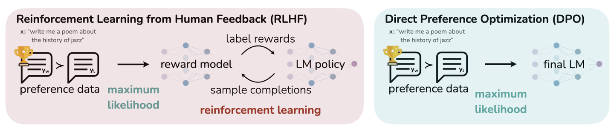
<figcaption>DPO在优化人类偏好时避免了使用强化学习。现有RLHF方法通常会首先使用一个奖励模型（Reward
Model）来拟合一个包含提示（Prompt）和人类对响应对（Response
Pair）偏好的数据集，然后通过强化学习找到一个能够最大化该奖励模型的策略（Policy）。相比之下，DPO
直接以简单的分类目标优化最能满足偏好的</figcaption>
</figure>

> DPO在优化人类偏好时避免了使用强化学习。现有RLHF方法通常会首先使用一个奖励模型（Reward
> Model）来拟合一个包含提示（Prompt）和人类对响应对（Response
> Pair）偏好的数据集，然后通过强化学习找到一个能够最大化该奖励模型的策略（Policy）。相比之下，DPO
> 直接以简单的分类目标优化最能满足偏好的策略，通过拟合一个隐式奖励模型，其对应的最优策略可以以闭式形式（Closed
> Form）提取出来。

\

### DPO的loss 

<figure data-size="normal">
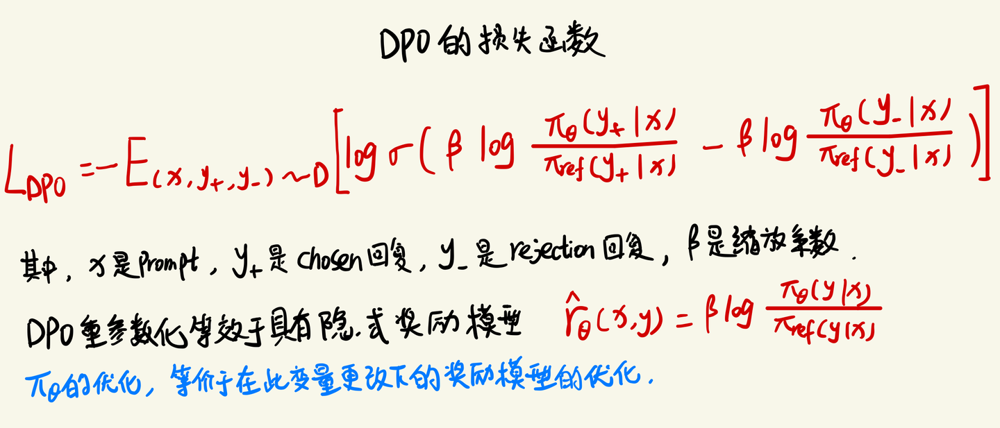
<figcaption>DPO的损失函数</figcaption>
</figure>

DPO loss的代码：

::: highlight
``` python
import torch.nn.functional as F
def dpo_loss(pi_logps, ref_logps, yw_idxs, yl_idxs, beta):
    """
    pi_logps: policy logprobs, shape (B,)
    ref_logps: reference model logprobs, shape (B,)
    yw_idxs: preferred completion indices in [0, B-1], shape (T,)
    yl_idxs: dispreferred completion indices in [0, B-1], shape (T,)
    beta: temperature controlling strength of KL penalty
    Each pair of (yw_idxs[i], yl_idxs[i]) represents the
      indices of a single preference pair.
"""
    pi_yw_logps,  pi_yl_logps =  pi_logps[yw_idxs],  pi_logps[yl_idxs]
    ref_yw_logps, ref_yl_logps = ref_logps[yw_idxs], ref_logps[yl_idxs]
    pi_logratios  = pi_yw_logps - pi_yl_logps
    ref_logratios = ref_yw_logps - ref_yl_logps
    losses = -F.logsigmoid(beta * (pi_logratios - ref_logratios))
    rewards = beta * (pi_logps - ref_logps).detach()
    return losses, rewards
```
:::

\

### DPO相比PPO有哪些改进？ 

在RLHF（人类反馈的强化学习）的背景下，DPO（Direct Preference
Optimization，直接偏好优化）和PPO（Proximal Policy
Optimization，近端策略优化）是两种用于微调大型语言模型（LLM）的方法。以下是这两种方法的一些关键改进点：

**简化的训练流程**：

- **DPO**：直接从人类偏好数据集中学习，不需要训练一个单独的奖励模型。这简化了训练流程，减少了计算资源的需求。
- **PPO**：通常需要训练一个奖励模型，然后使用这个模型来指导策略的优化，这需要更多的计算资源和时间。

**对超参数的鲁棒性**：

- **DPO**：对超参数的变化更为鲁棒，不容易陷入局部最优，也不需要频繁调整超参数。
- **PPO**：对超参数的选择较为敏感，可能需要仔细调整以避免训练不稳定。

**计算效率和效果**：

- **DPO**：有些情况下，DPO能够用更少的资源达到接近PPO的效果，在计算效率方面有优势。不过在适合RL
  scaling的场景下，DPO在效果上和PPO的差距还是比较大的。
- **PPO**：虽然可以达到很高的性能，但通常需要更多的计算资源和数据。

**模型解释性和用户偏好的适应性**：

- **DPO**：由于直接从用户偏好数据学习，DPO通常具有更好的解释性，更容易理解模型的决策过程，并且能够更灵活地适应不同用户的个性化偏好。
- **PPO**：由于其基于奖励的优化机制，PPO可能在解释模型的行为时遇到困难，特别是在复杂的任务中，其决策过程可能不那么直观。

### DPO和SFT有什么相同点和不同点？ 

DPO（Direct Preference Optimization）和SFT（Supervised
Fine-Tuning）都是用于优化大型语言模型（LLMs）的方法，旨在改善模型生成文本的质量，使其更符合人类的偏好。下面是它们的一些相同点和不同点：

**相同点**：

1.  **目标导向**：两者都旨在通过调整语言模型的参数来优化其输出，使之更加符合特定的目标或偏好。
2.  **数据依赖**：DPO和SFT都**依赖于外部数据来指导模型的微调过程**（与之不同的是，PPO/GRPO是依赖外部的reward来指导模型的训练)。DPO使用偏好数据，而SFT通常使用带有标签的示例数据。

**不同点**：

**数据形式与处理**：

- **DPO**：直接利用偏好数据进行优化，这种偏好数据可以体现为正负样本对比，无需显式构建奖励模型。它通过偏好反馈（如用户偏好评级）直接优化策略，使得模型学习到什么样的输出是更受欢迎或更符合预期的。
- **SFT**：依赖于有监督的标签数据，即输入-输出对的形式，其中输出是人工标注的理想响应或文本。这种方法更像是传统的机器学习任务中的监督学习，通过已知正确答案来调整模型以减少预测误差。

**优化目标与过程**：

- **DPO**：优化过程关注于**最大化偏好数据下策略的表现**，通过**对比学习**等技术直接在策略上进行优化，避免了额外的奖励函数建模步骤。
- **SFT**：目标是使模型输出尽可能匹配给定的标签数据，优化目标通常是最大化似然或**最小化交叉熵损失**，这是一个直接的监督学习问题。

**复杂度与灵活性**：

- **DPO**：可能在处理复杂的偏好表达和非结构化的偏好数据上更有优势，因为它不依赖于精确的评分或奖励信号，而是通过比较学习。
- **SFT**：在任务明确且有高质量标注数据的情况下更为直接有效，但可能在处理模糊或高度主观的偏好表达上不如DPO灵活。

**应用场景**：

- **DPO**：适合于那些偏好标准不易量化或者偏好数据可以通过比较获得的场景，比如艺术创作、个性化推荐等。
- **SFT**：更适合于有明确正确答案或标准输出的任务，如问答系统、翻译任务等。

综上所述，DPO和SFT各有侧重，选择哪种方法取决于具体任务的需求、数据的性质以及对模型输出质量的具体要求。

## DPO改进版本 

### IPO【19】 

**DPO
的一个缺点是它在人类偏好数据集上很快就会过拟合**。为了避免这种情况，谷歌
DeepMind 的研究人员引入了身份偏好优化（IPO），这种方法**为 DPO
损失添加了一个正则，能够在不使用「提前停止」等技巧的情况下让模型收敛**。

\

### KTO【20】 

**Kahneman-Tversky优化（KTO）**：KTO是一种基于人类心理认知过程的偏好优化算法。它通过分析人类在决策过程中的心理认知过程（如注意力分配、记忆提取等），来优化模型的输出。**KTO的一个显著特点是它不需要成对的偏好数据，只需将样本标注为"好"或"坏"，降低了数据收集的成本和难度**。然而，如何准确地模拟人类的心理认知过程，以及将这种模拟结果应用到实际场景中，仍是KTO需要解决的问题。

## GRPO【12】 

### 相对PPO的改进 

GRPO是对PPO的一种改进版本，属于online
RL。它通过暴力采样求均值的方式替代了PPO中的Critic
Model，同时保留了PPO中的重要性采样和裁剪机制。GRPO中冻结了Ref和RM
2个模型，仅需要训练Policy Model。

<figure data-size="normal">
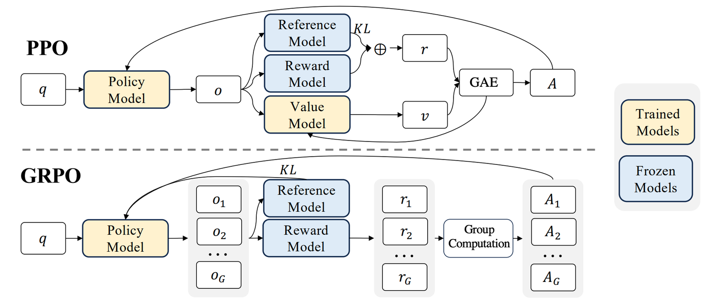
<figcaption>图4 |
PPO与我们提出的GRPO的演示。GRPO放弃了价值模型，而是通过小组得分估计基线，从而显著减少了训练资源的消耗。【12】</figcaption>
</figure>

\

### 目标函数 

GRPO的目标函数

<figure data-size="normal">
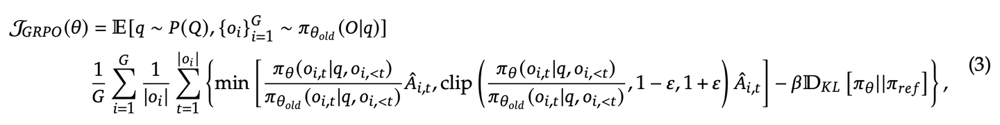
</figure>

## DAPO 【27】 

这是字节跳动seed团队对GRPO的重要改进。**GRPO
面临四个主要问题：其单一剪切范围易导致低概率 Token
无法得到有效提升（熵坍塌），样本级别损失会弱化长序列 Token
的梯度贡献，一旦所有输出都是全对或全错则无梯度信号可用，且统一惩罚过长生成会引入噪声**。

DAPO 则通过"四大改进"逐一解决：

- **Clip-Higher 将剪切上下限分开以保留多样性；**
- **Dynamic Sampling 过滤全对/全错样本保持有效梯度；**
- **Token-Level Policy Gradient Loss 平衡长序列 Token 贡献；**
- **Overlong Reward Shaping
  为过长文本进行柔性惩罚或掩码，减少噪声干扰。**

<figure data-size="normal">

</figure>

详细可参考下面文章【28】。

[[]{.LinkCard-image .LinkCard-image--default}[[]{.LinkCard-title
.loading data-text="true"}[]{.LinkCard-desc
.loading}]{.LinkCard-contents}](https://zhuanlan.zhihu.com/p/1888687830710084683){.LinkCard
.new draft-node="block" draft-type="link-card"
image="https://pica.zhimg.com/equation_ipico.jpg"
data-text="大家好我是爱因：DAPO：GRPO的问题分析及四个改进策略"
target="_blank"}

\

## Dr. GRPO【29】 

作者认为**GRPO算法在优化目标上存在的"长度偏置"会导致模型产生冗长但不一定正确的回答。为解决这一问题，作者提出了
Dr.
GRPO，即在不牺牲推理性能的前提下消除不必要的冗长，显著提高了"token效率"（token
efficiency）。基于此，他们给出了一份简化的 R1-Zero 训练配方**：在
Qwen2.5-Math-7B 模型上仅用 27
小时就获得了在多项数学竞赛数据集上的最新最优结果（AIME2024 准确率达到
43.3%）。

<figure data-size="normal">
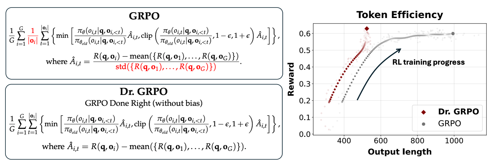
<figcaption>图 1：左图：Dr. GRPO 通过去除长度和标准差归一化项，对
GRPO（Shao
等，2024）进行了简单但重要的修改，以解决其偏差问题。右图：我们提出的无偏优化器有效地防止模型生成越来越长但错误的回答，从而提升了
token 效率。</figcaption>
</figure>

详细可参考文章【30】。

[[]{.LinkCard-image .LinkCard-image--default}[[]{.LinkCard-title
.loading data-text="true"}[]{.LinkCard-desc
.loading}]{.LinkCard-contents}](https://zhuanlan.zhihu.com/p/1891404563971564359){.LinkCard
.new draft-node="block" draft-type="link-card"
image="https://picx.zhimg.com/equation_ipico.jpg"
data-text="大家好我是爱因：理解 R1-Zero 式训练：一个批判性视角"
target="_blank"}

\

## RLOO【13，23】 

背景：在基于策略梯度的RL方法中，REINFORCE 和
PPO相比更加基础和简单（详情参考本文"REINFORCE 和
PPO的区别和联系"小节）。RLOO（REINFORCE
Leave-One-Out）是REINFORCE的改进版。

RLOO的提出者认为，由于RLHF的起点是训练好的SFT模型，而不是参数随机初始化的模型，在PPO中诸如GAE、CLIP这些用于稳定训练的策略是没必要的。

通过将整个回复生成当作一个action，并用样本间差异取代critic
model，RLOO可以使训练更简单，性能也很好。

\

**RLOO 的提出动机**：

1.  **RLHF和传统RL不同**。相比传统的RL，RLHF中的初始policy更好，因此PPO中的很多假设和技巧是没必要的。
2.  **降低计算资源需求**：PPO
    通常需要同时加载四个模型（actor/critic/reward/reference），这对 GPU
    内存提出了很高的要求。RLOO
    通过减少所需模型的数量，降低了内存占用，使得训练过程更高效。
3.  **简化实现复杂性**：PPO
    的实现涉及许多微妙的细节，可能难以正确把握。RLOO 采用更直接的
    REINFORCE 风格优化，减少了实现过程中的复杂性。
4.  **提高训练效率**：RLOO
    的设计使其能够使用更大的批量大小，缩短训练时间，从而加快模型的收敛速度。

<figure data-size="normal">
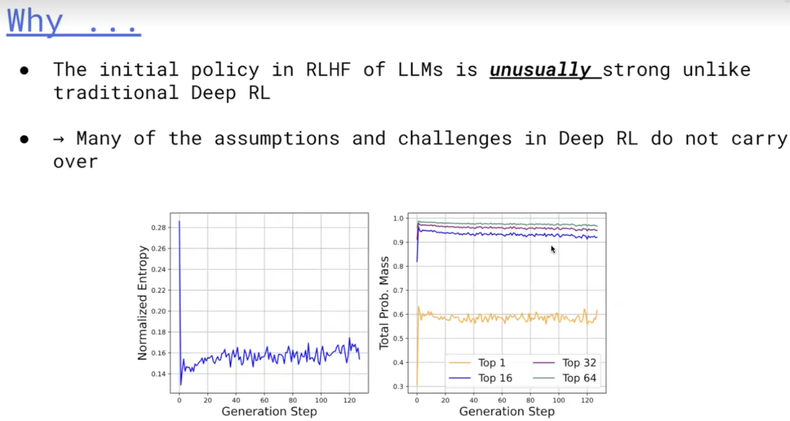
<figcaption>【23】</figcaption>
</figure>

\

**RLOO 与 PPO 的区别和优点**：

1.  **模型副本数量****：PPO 需要加载四个模型**副本，而 **RLOO
    只需三个**（actor/reward/reference），减少了对 GPU 内存的需求。
2.  **动作建模方式**：PPO 将每个生成的 token 视为单独的动作，而 RLOO
    将整个生成序列视为一个动作。这种方式减少了稀疏奖励问题，提高了训练效率。
3.  **基线计算方法**：RLOO
    使用批次中其他样本的奖励作为基线，避免了训练价值模型的需要，进一步简化了实现过程。
4.  **训练速度和内存使用**：根据实验，RLOO 在相同模型规模下，比 PPO
    使用的 GPU 内存减少约 50-70%，训练速度提高 2-3 倍。【17】
5.  **性能表现**：在响应质量方面，RLOO 与 PPO
    相当，并且始终优于一些流行的离线方法。

\

综上所述，RLOO
通过简化模型架构、降低计算资源需求和提高训练效率，提供了一种比 PPO
更加高效且易于实现的在线强化学习算法。

\

<figure data-size="normal">
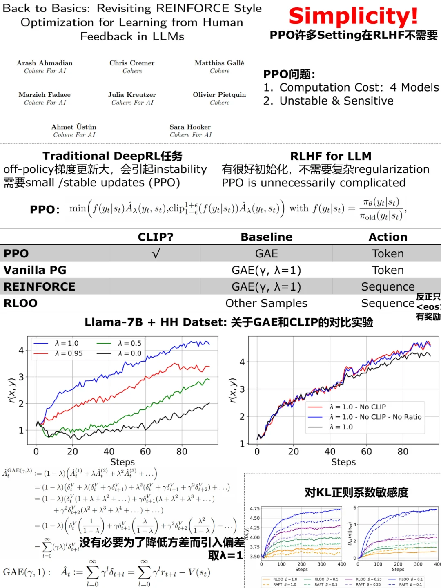
<figcaption>RLOO介绍【16】</figcaption>
</figure>

\

## REINFORCE++【26】 

### 简介 

**REINFORCE++**是一种增强版的经典 **REINFORCE** 算法，结合了 **PPO**
的关键优化技术，同时去除了对 **critic network** 的依赖。

**REINFORCE++** 主要实现了三个核心目标：

- 简洁性
- 增强的训练稳定性
- 降低计算开销。

### 优点 

论文中通过广泛的实证评估，证明了 **REINFORCE++** 在稳定性上优于
**GRPO**，并且在保持与 **PPO** 相当的性能的同时，实现了更高的计算效率。

- **通用场景（采用 Bradley-Terry Reward Models）****：REINFORCE++**
  在稳定性方面优于 **GRPO**，特别是在防止奖励和输出长度 **hacking**
  方面（图 1）。
- **基于规则的奖励模型（Rule-Based Reward
  Model）**：在基于规则的奖励场景下，**REINFORCE++** 与采用 **group
  normalization** 的 **GRPO** 取得了可比较的性能（图 2）。
- **数学奖励模型（Mathematical Reward
  Model）**：在数学问题求解场景中，**REINFORCE++** 相较于
  **GRPO**，在每单位 **KL divergence** 下实现了更大的奖励提升（图 3）。

<figure data-size="normal">
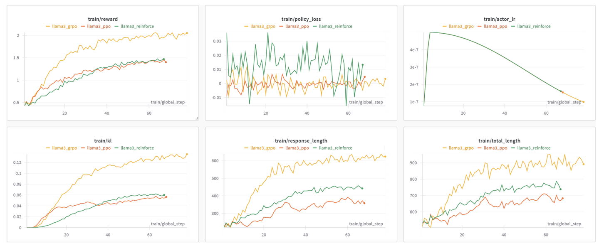
<figcaption>图 1：通用领域结果表明，在采用 Bradley-Terry Reward Models
的一般场景中，PPO 和 REINFORCE++ 相较于 GRPO 具有较小的 length hacking
问题。</figcaption>
</figure>

<figure data-size="normal">
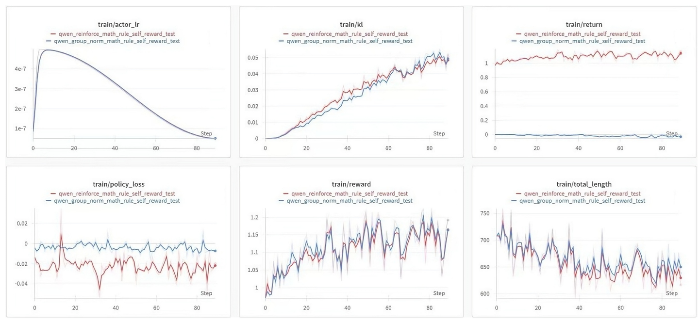
<figcaption>图 2：数学场景 1 表明，在基于规则的奖励下，REINFORCE++ 与
GRPO (Group Norm) 取得了可比较的结果。</figcaption>
</figure>

<figure data-size="normal">
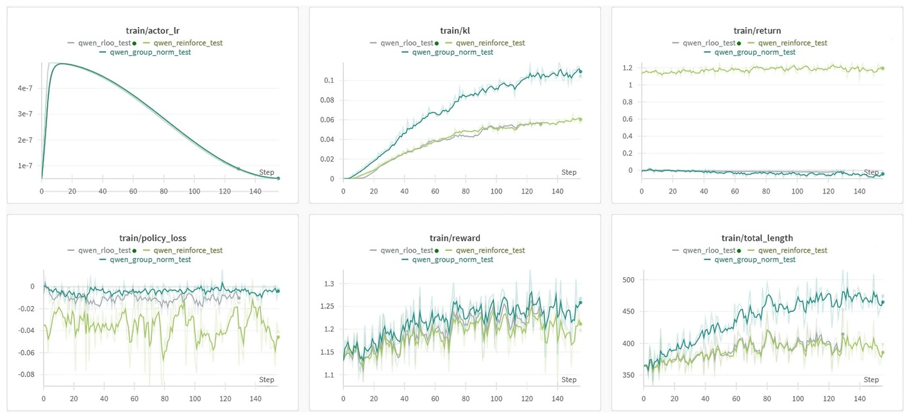
<figcaption>图 3：数学场景 2 的结果表明，在相同单位 KL
消耗下，REINFORCE++ 和 RLOO 相较于 GRPO (Group Norm)
实现了更大的奖励提升。</figcaption>
</figure>

### 优化方法 

Reinforce++为提升训练稳定性和效率，融合了多种优化方法，从不同层面改进经典REINFORCE算法，在避免引入过多复杂度的同时，有效应对了RLHF面临的挑战。具体采用的方法如下：

1\. **Token-Level KL Penalty（令牌级KL散度惩罚）**：

在RL模型和监督微调（SFT）模型的分布之间实施令牌级KL散度惩罚，并将其纳入奖励函数。公式为
$r(s\_{t}, a\_{t}) = I(s\_{t}=[EOS]) r(x, y)-\\beta KL(t)$ 
，其中

$KL(t)=log (\\frac{\\pi\_{\\theta\_{old }}\^{RL}(a\_{t} \|
s\_{t})}{\\pi\^{SFT}(a\_{t} \| s\_{t})})$}^{RL}(a_{t} | s_{t})}{\\pi^{SFT}(a_{t} | s_{t})})"}

这种方式有助于更合理地分配奖励，并且能与过程奖励模型（PRM）无缝集成，提升训练的稳定性。

2\. **PPO-Clip Integration（集成PPO的裁剪机制）**：

引入近端策略优化（PPO）的裁剪机制来限制策略更新。通过公式
[L\^{CLIP}(\\theta)=\\mathbb{E}\_{t}\[min (r\_{t}(\\theta)
\\hat{A}\_{t}, clip(r\_{t}(\\theta), 1-\\epsilon, 1+\\epsilon)
\\hat{A}\_{t})\]](\\theta)=\\mathbb{E}_{t}[min (r_{t}(\\theta) \\hat{A}_{t}, clip(r_{t}(\\theta), 1-\\epsilon, 1+\\epsilon) \\hat{A}_{t})]"}
，

将概率比率 $r\_{t}(\\theta)$(\\theta)"}
限制在 [\$1-\\epsilon, 1+\\epsilon\$ 范围内（通常 $\\epsilon =
0.2$
）。这使得算法既能利用正向优势，又能防止因过大的更新导致训练不稳定，维持了策略更新的信任区域。

3\. **Mini-Batch Updates（小批量更新）**：

通过小批量处理数据提升训练效率。具体表现为数据以较小的、可管理的块进行处理，而非全量更新；每个小批量允许进行多次参数更新，加快收敛速度；引入随机优化，增加了有益的随机性，有助于模型更好地泛化。

4\. **Reward Normalization and Clipping（奖励归一化和裁剪）**：

对奖励进行全面处理以稳定训练。通过Z
-score归一化来标准化奖励，减少异常值的影响；将奖励值限制在预定义的范围内，避免训练不稳定；应用适当的缩放因子，确保在更新过程中的数值稳定性。

5\. **Advantage Normalization（优势归一化）**：

Reinforce++中优势函数定义为 $A\_{t}(s\_{t}, a\_{t}) = r(x, y)-\\beta
\\cdot \\sum\_{i=t}\^{T} KL(i)$(s_{t}, a_{t}) = r(x, y)-\\beta \\cdot \\sum_{i=t}^{T} KL(i)"}
，并使用z score归一化，即 $A\_{normalized
}=\\frac{A-\\mu\_{A}}{\\sigma\_{A}}$=\\frac{A-\\mu_{A}}{\\sigma_{A}}

（ $\\mu\_{A}$"} 和
$\\sigma\_{A}$"}
分别表示批次均值和标准差）。这种归一化方式保证了梯度的稳定性，防止训练过程中的发散。

\

## 参考资料 

[【1】Deep Reinforcement Learning from Human
Preferences](https://link.zhihu.com/?target=https%3A//arxiv.org/pdf/1706.03741){.wrap
.external rel="nofollow noreferrer" target="_blank"}

[【2】Training language models to follow instructions with human
feedback](https://link.zhihu.com/?target=https%3A//arxiv.org/pdf/2203.02155){.wrap
.external rel="nofollow noreferrer" target="_blank"}

[【3】吴恩达《从人类反馈中进行强化学习RLHF, Reinforcement Learning from
Human
Feedback》（中英字幕）\_哔哩哔哩_bilibili](https://link.zhihu.com/?target=https%3A//www.bilibili.com/video/BV1R94y1P7QX/%3Fshare_source%3Dcopy_web%26vd_source%3D4029b709c8dab921079939a0bdd5ec6c){.wrap
.external rel="nofollow noreferrer" target="_blank"}

【4】大规模语言模型从理论到实践

【5】[从0到1构建RLHF系统------小红书大模型团队的探索与实践](https://link.zhihu.com/?target=https%3A//mp.weixin.qq.com/s/tG_ktQ0WbZHQavtoJtaXbw){.wrap
.external rel="nofollow noreferrer" target="_blank"}

【6】[为什么RLHF中，PPO需要Critic模型而不是直接使用RewardModel -
风生水起 -
博客园](https://link.zhihu.com/?target=https%3A//www.cnblogs.com/end/p/17481052.html){.wrap
.external rel="nofollow noreferrer" target="_blank"}

【7】[初七123334：RLHF 对齐之 REINFORCE++ 算法 - 比 GRPO
稳定比PPO快](https://zhuanlan.zhihu.com/p/14888098807){.internal
target="_blank"}

【8】[演练 - 强化学习经典算法实验之REINFORCE -
字舞流文](https://link.zhihu.com/?target=https%3A//paperexplained.cn/aplayground/iarticle/detail/0454c3b5-be1a-4aff-a146-9c5adaf76600/){.wrap
.external rel="nofollow noreferrer" target="_blank"}

【9】[openRLHF
slides](https://link.zhihu.com/?target=https%3A//docs.google.com/presentation/d/1JRhB1d7csofx0PIZBmfyBdMluxNd5JLPpUHrrvVhGnk/edit%23slide%3Did.g2650ce3df47_0_0){.wrap
.external rel="nofollow noreferrer" target="_blank"}

【10】[重要性采样详解及其在PPO算法中的应用](https://link.zhihu.com/?target=https%3A//blog.csdn.net/shizheng_Li/article/details/144468429){.wrap
.external rel="nofollow noreferrer" target="_blank"}

【11】[Direct Preference Optimization: Your Language Model is Secretly a
Reward
Model](https://link.zhihu.com/?target=https%3A//arxiv.org/pdf/2305.18290){.wrap
.external rel="nofollow noreferrer" target="_blank"}

【12】[DeepSeekMath: Pushing the Limits of Mathematical Reasoning in
Open Language
Models](https://link.zhihu.com/?target=https%3A//arxiv.org/pdf/2402.03300){.wrap
.external rel="nofollow noreferrer" target="_blank"}

【13】[Back to Basics: Revisiting REINFORCE Style Optimization for
Learning from Human Feedback in
LLMs](https://link.zhihu.com/?target=https%3A//arxiv.org/pdf/2402.14740){.wrap
.external rel="nofollow noreferrer" target="_blank"}

【14】[[https://]{.invisible}[deepreinforcementlearningbook.org]{.visible}[/assets/pdfs/ch3.pdf]{.invisible}[]{.ellipsis}](https://link.zhihu.com/?target=https%3A//deepreinforcementlearningbook.org/assets/pdfs/ch3.pdf){.external
rel="nofollow noreferrer" target="_blank"}

【15】[强化学习基本问题回顾总结 \| Xwell\'s
Blog](https://link.zhihu.com/?target=https%3A//imxwell.com/blog/rl_basic/){.wrap
.external rel="nofollow noreferrer" target="_blank"}

【16】[RLOO：比PPO更适合LLM的RLHF方法 -
小红书](https://link.zhihu.com/?target=https%3A//www.xiaohongshu.com/explore/6732c5ca000000001a01d343%3Fxsec_token%3DABO2vbisf8d7CC4oYpTya1zwMkKyW-ipv7a-PShemePLo%3D%26xsec_source%3Dpc_search%26source%3Dunknown){.wrap
.external rel="nofollow noreferrer" target="_blank"}

【17】[putting rl back in rlhf with
rloo](https://link.zhihu.com/?target=https%3A//huggingface.co/blog/zh/putting_rl_back_in_rlhf_with_rloo%3Futm_source%3Dchatgpt.com){.wrap
.external rel="nofollow noreferrer" target="_blank"}

【18】[Advanced Tricks for Training Large Language Models with Proximal
Policy
Optimization](https://link.zhihu.com/?target=https%3A//hijkzzz.notion.site/rlhf-implementation-tricks%3Fv%3D158d9a33ecc98132bf9e000c39227361){.wrap
.external rel="nofollow noreferrer" target="_blank"}

【19】[A General Theoretical Paradigm to Understand Learning from Human
Preferences](https://link.zhihu.com/?target=https%3A//arxiv.org/pdf/2310.12036){.wrap
.external rel="nofollow noreferrer" target="_blank"}

【20】[KTO: Model Alignment as Prospect Theoretic
Optimization](https://link.zhihu.com/?target=https%3A//arxiv.org/pdf/2402.01306){.wrap
.external rel="nofollow noreferrer" target="_blank"}

【21】[A general language assistant as a laboratory for
alignment](https://link.zhihu.com/?target=https%3A//arxiv.org/pdf/2112.00861){.wrap
.external rel="nofollow noreferrer" target="_blank"}

【22】[Understanding the effects of rlhf on llm generalisation and
diversity](https://link.zhihu.com/?target=https%3A//arxiv.org/pdf/2310.06452){.wrap
.external rel="nofollow noreferrer" target="_blank"}

【23】[RLOO一作讲解RLOO](https://link.zhihu.com/?target=https%3A//www.bilibili.com/video/BV1PSDmYkEj1){.wrap
.external rel="nofollow noreferrer" target="_blank"}

【24】[[https://]{.invisible}[openai.com/index/faulty]{.visible}[-reward-functions/]{.invisible}[]{.ellipsis}](https://link.zhihu.com/?target=https%3A//openai.com/index/faulty-reward-functions/){.external
rel="nofollow noreferrer" target="_blank"}

【25】[何枝：【RLHF】RL 究竟是如何与 LLM
做结合的？](https://zhuanlan.zhihu.com/p/675329917){.internal
target="_blank"}

【26】[REINFORCE++: A SIMPLE AND EFFICIENT APPROACH FOR ALIGNING LARGE
LANGUAGE
MODELS](https://link.zhihu.com/?target=https%3A//arxiv.org/pdf/2501.03262){.wrap
.external rel="nofollow noreferrer" target="_blank"}

【27】[DAPO: An Open-Source LLM Reinforcement Learning System at
Scale](https://link.zhihu.com/?target=https%3A//arxiv.org/pdf/2503.14476){.wrap
.external rel="nofollow noreferrer" target="_blank"}

【28】[大家好我是爱因：DAPO：GRPO的问题分析及四个改进策略](https://zhuanlan.zhihu.com/p/1888687830710084683){.internal
target="_blank"}

【29】[Understanding R1-Zero-Like Training: A Critical
Perspective](https://link.zhihu.com/?target=https%3A//arxiv.org/pdf/2503.20783){.wrap
.external rel="nofollow noreferrer" target="_blank"}

【30】[大家好我是爱因：理解 R1-Zero
式训练：一个批判性视角](https://zhuanlan.zhihu.com/p/1891404563971564359){.internal
target="_blank"}
::::

[]{#VirtualCatalogAnchorPoint}
::::::
:::::::
::::::::

::::::: Reward
<div>

:::: css-zkfaav
![](data:image/svg+xml;base64,PHN2ZyBjbGFzcz0iWkRJIFpESS0tR2lmdDI0IiBmaWxsPSJjdXJyZW50Q29sb3IiIGhlaWdodD0iMTgiIHZpZXdib3g9IjAgMCAyNCAyNCIgd2lkdGg9IjE4Ij48cGF0aCBjbGlwLXJ1bGU9ImV2ZW5vZGQiIGQ9Ik0xNy4yNCA1Ljc2OGMuNTIyLTIuMDg5LTEuMzk3LTMuOTY4LTMuNDc0LTMuNDAxLS44OTIuMjQzLTEuNi45MDUtMS45MDkgMS43NmEyLjY3NSAyLjY3NSAwIDAgMC0xLjc2OC0xLjcxNEM4LjEwMiAxLjgxNyA2LjIyMiAzLjYxIDYuNzI1IDUuNjI0bC4xNzIuNjg5SDQuNzk2QTIuNTQ2IDIuNTQ2IDAgMCAwIDIuMjUgOC44NTl2MS44MTRjMCAuOTIuNDg4IDEuNzI2IDEuMjE5IDIuMTczdjYuNzY1YTIuNTQ2IDIuNTQ2IDAgMCAwIDIuNTQ2IDIuNTQ1aDExLjk3YTIuNTQ2IDIuNTQ2IDAgMCAwIDIuNTQ2LTIuNTQ1di02Ljc2NWEyLjU0NCAyLjU0NCAwIDAgMCAxLjIxOS0yLjE3M1Y4Ljg2YTIuNTQ2IDIuNTQ2IDAgMCAwLTIuNTQ2LTIuNTQ2aC0yLjFsLjEzNS0uNTQ1Wm0xLjY2NiA3LjQ1MUgxMi44MTJ2Ny4zMTJoNS4xNzNhLjkyLjkyIDAgMCAwIC45MjEtLjkydi02LjM5MlptLTcuNzE4IDBINS4wOTR2Ni4zOTJjMCAuNTA4LjQxMi45Mi45Mi45MkgxMS4xODlWMTMuMjJabTQuMjQtNi45MDZoLTIuNDE1bC4zMy0xLjQ4N2ExLjE5MiAxLjE5MiAwIDEgMSAyLjMyLjU0N2wtLjIzNS45NFptLjYzNCAxLjYyNUgxOS4yMDRhLjkyLjkyIDAgMCAxIC45MjEuOTJ2MS44MTVhLjkyLjkyIDAgMCAxLS45Mi45MjFINC43OTRhLjkyLjkyIDAgMCAxLS45Mi0uOTJWOC44NThhLjkyLjkyIDAgMCAxIC45Mi0uOTIxaDExLjI2OFptLTcuNDktMS42MjVoMi4zbC0uNTU2LTEuNjdhMS4wNSAxLjA1IDAgMCAwLTIuMDE1LjU4N2wuMjcgMS4wODNaIiBmaWxsLXJ1bGU9ImV2ZW5vZGQiIC8+PC9zdmc+){.ZDI
.ZDI--Gift24}

::: css-71c0x4
送礼物
:::
::::

</div>

::: {.Reward-countZero .css-1vbn52a}
还没有人送礼物，鼓励一下作者吧
:::
:::::::

::: {.ContentItem-time role="button" tabindex="0"}
编辑于 2025-04-05 15:16・上海
:::

:::::::::: Post-topicsAndReviewer
::::::::: {.TopicList .Post-Topics}
:::: {.Tag .Topic .css-ch8ocw}
[[](//www.zhihu.com/topic/20039099){.TopicLink
target="_blank"}]{.Tag-content}

::: css-1gomreu
强化学习 (Reinforcement Learning)
:::
::::

:::: {.Tag .Topic .css-ch8ocw}
[[](//www.zhihu.com/topic/25402720){.TopicLink
target="_blank"}]{.Tag-content}

::: css-1gomreu
大模型
:::
::::

:::: {.Tag .Topic .css-ch8ocw}
[[](//www.zhihu.com/topic/27239249){.TopicLink
target="_blank"}]{.Tag-content}

::: css-1gomreu
多模态大模型
:::
::::
:::::::::
::::::::::

<div>

::::::::: {.Sticky .RichContent-actions .is-bottom}
:::::::: ContentItem-actions
[​{.Zi
.Zi--TriangleUp
.VoteButton-TriangleUp}]{style="display:inline-flex;align-items:center"}赞同
335

[​{.Zi
.Zi--TriangleDown}]{style="display:inline-flex;align-items:center"}

[​{.Zi
.Zi--Comment .Button-zi
.t2ntD6J1DemdOdvh5FB4}]{style="display:inline-flex;align-items:center"}13
条评论

:::: {.Popover .ShareMenu}
::: {#null-toggle .ShareMenu-toggler aria-expanded="false" aria-haspopup="true"}
[​{.ZDI
.ZDI--PaperplaneFill24 .Button-zi
.t2ntD6J1DemdOdvh5FB4}]{style="display:inline-flex;align-items:center"}分享
:::
::::

[​{.Zi
.Zi--Heart .Button-zi
.t2ntD6J1DemdOdvh5FB4}]{style="display:inline-flex;align-items:center"}喜欢

[​{.Zi
.Zi--Star .Button-zi
.t2ntD6J1DemdOdvh5FB4}]{style="display:inline-flex;align-items:center"}收藏

[​{.Zi
.Zi--Deliver .Button-zi
.t2ntD6J1DemdOdvh5FB4}]{style="display:inline-flex;align-items:center"}申请转载

::::: Post-ActionMenuButton
:::: Popover
::: {#null-toggle aria-expanded="false" aria-haspopup="true"}
[​{.Zi
.Zi--Dots .Button-zi
.t2ntD6J1DemdOdvh5FB4}]{style="display:inline-flex;align-items:center"}
:::
::::
:::::
::::::::
:::::::::

</div>
::::::::::::::::::::::::::::::::::::::::::::
:::::::::::::::::::::::::::::::::::::::::::::

:::::::::::::::::::::::: {.Post-Row-Content-right .css-1qyytj7}
[]{.css-cejtq2 aria-keyshortcuts="Shift+S" aria-label="边栏锚点"}

<div>

</div>

:::::::::::::::::::::: {style="position:sticky;top:62px"}
::::::::::::::::::::: {.Card .AuthorCard aria-label="关于作者" role="complementary"}
:::: {.Card-header .AuthorCard-title}
::: Card-headerText
关于作者
:::
::::

::::::: Card-section
:::::: AuthorCard-user
::: AuthorCard-user-avatar
[[](//www.zhihu.com/people/iamein){.UserLink-link
za-detail-view-element_name="User"
target="_blank"}]{.UserLink}{.Avatar
.UserLink-avatar .css-1qhd7fe
srcset="https://picx.zhimg.com/v2-c5d9627d9e98fd98830eeced564275cb_xl.jpg?source=172ae18b 2x"}
:::

:::: AuthorCard-user-content
::: AuthorCard-user-name
[[大家好我是爱因](//www.zhihu.com/people/iamein){.UserLink-link
za-detail-view-element_name="User" target="_blank"}]{.UserLink}
:::
::::
::::::
:::::::

::: Card-section
:::

:::::::::::: Card-section
:::::::::: AuthorCard-counts
::::::::: NumberBoard
[](//www.zhihu.com/people/iamein/answers){.NumberBoard-item
za-detail-view-element_name="Answer" preset="plain"}

:::: NumberBoard-itemInner
::: NumberBoard-itemName
回答
:::
::::

[](//www.zhihu.com/people/iamein/posts){.NumberBoard-item
za-detail-view-element_name="Post" preset="plain"}

:::: NumberBoard-itemInner
::: NumberBoard-itemName
文章
:::
::::

[](//www.zhihu.com/people/iamein/followers){.NumberBoard-item
za-detail-view-element_name="Follower" preset="plain"}

:::: NumberBoard-itemInner
::: NumberBoard-itemName
关注者
:::
::::
:::::::::
::::::::::

::: {.MemberButtonGroup .AuthorCard-buttons}
[​{.Zi
.Zi--Plus
.FollowButton-icon}]{style="display:inline-flex;align-items:center"}关注他

[​{.Zi
.Zi--Comments .Button-zi
.t2ntD6J1DemdOdvh5FB4}]{style="display:inline-flex;align-items:center"}发私信
:::
::::::::::::
:::::::::::::::::::::
::::::::::::::::::::::
::::::::::::::::::::::::
::::::::::::::::::::::::::::::::::::::::::::::::::::::::::::::::::::

::: {.Post-Sub .Post-NormalSub}
:::
:::::::::::::::::::::::::::::::::::::::::::::::::::::::::::::::::::::::::
::::::::::::::::::::::::::::::::::::::::::::::::::::::::::::::::::::::::::$
$$$